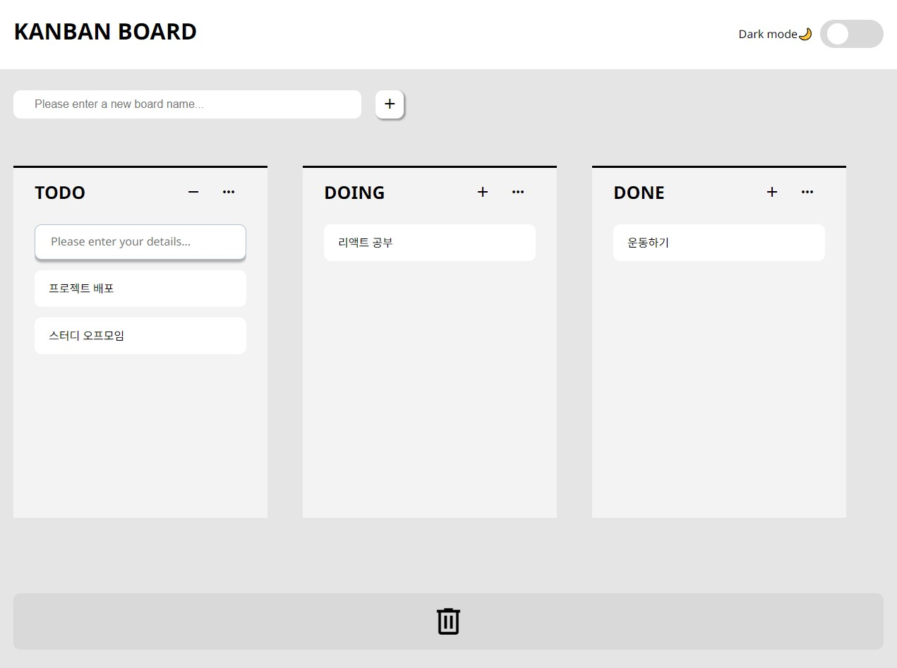

# 📚KANBAN BOARD
-------------
간단한 TODO 관리를 위한 칸반보드 웹페이지 입니다.  
board를 생성하고 아이템을 생성해 drag & drop으로 todo 관리 및 삭제가 가능합니다.  
다크모드도 구현되어 있습니다.

https://wonyj0228.github.io/kanban-board/ <-- 프로젝트 링크!

### 🖥️ 프로젝트 소개
-------------

노마드코더의 'ReactJS로 영화 웹 서비스 만들기' 강의를 수강한 뒤,  
토이 프로젝트로 만든 KANBAN BOARD 웹 페이지 입니다.   

**Recoil** 을 사용해 상태관리를 하였고  
**Recoil-persist** 로 localStorage에 데이터를 저장가능하게 했습니다.  
**react-hook-form**을 사용해 데이터 입력 코드의 효율을 높였습니다.  

**styled component**로 css를 다뤘고 
**Framer-motion**과 **react-beautiful-dnd**로 애니메이션을 적용했습니다.   

Drag n Drop 기능과 입력 폼 관리를 라이브러리로 사용해 개발 효율을 높이려는 목적을 가진 프로젝트입니다.   

### 🕰️개발 기간
-------------
#### 학습 기간 : 2024.07.01~ 2024.07.26 (26일)
#### 개발 기간 : 2024.07.27 ~ 2024.08.07, 2024.08.19 ~ 2024.08.29 (20일)

### 🎪 프리뷰
-------------

### ⚙️ 개발 환경
-------------
- IDE : 
- Stack :   
- State : 
- Library :   , React-beautiful-dnd, Framer motion, Recoil Persist 

### 📌 주요 기능
-------------
| # | Function | Preview | Point |
|:---:|:----------:|:---------:|-------|
| 1 | 보드추가         |      |  ✔ react-hook-form을 사용해 만든 입력폼   ✔ board 이름을 입력하고 엔터 혹은 버튼을 누르면 보드가 추가되는 애니메이션과 함께 마운트   |
| 2 | 아이템추가      |       |  ✔ board 내 + 버튼 클릭 시 입력폼 마운트    ✔ 텍스트 크기에 따라 입력 폼이 resize 되는 기능   ✔ shift+enter 입력 시 줄바꿈이 가능하고 enter 입력 시 아이템이 추가됨   |
| 3 | 보드 및 아이템 이동         |         | ✔ react-beutiful-dnd를 사용한 drag N drop 애니메이션   ✔ 아이템을 보드 간 이동할 수 있고 보드끼리고 위치를 변경할 수 있음 |
| 4 | 삭제        |         | ✔ drag N drop으로 삭제 가능   ✔ 아이템만 개별로 삭제도 가능하고 보드 자체 삭제도 가능 |
| 5 | 다크모드         |         | ✔ 상단 toggle버튼 클릭 시 drak모드로 변경 |

